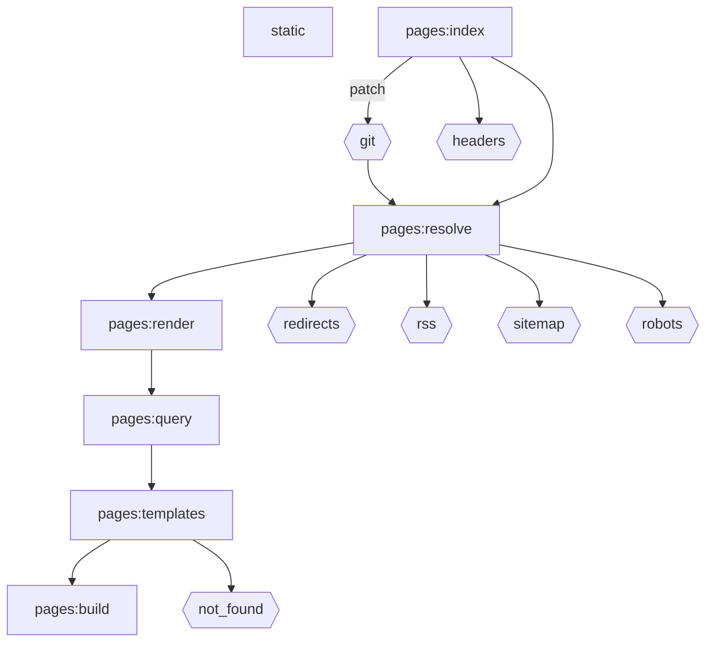

The build pipeline is modeled as a directed acyclic graph of steps. Page
indexing feeds the page render path and the optional output artefacts.

The Mermaid source is also available as [`/build-step-dag.mmd`](/build-step-dag.mmd).
